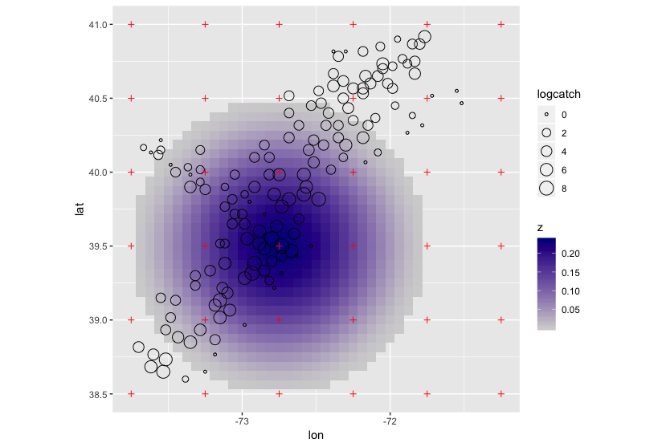
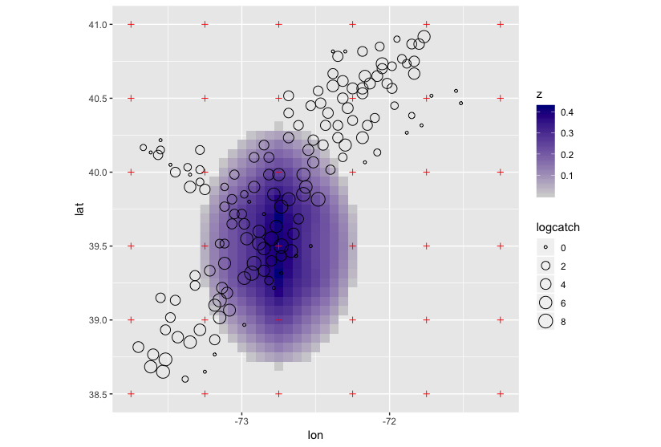
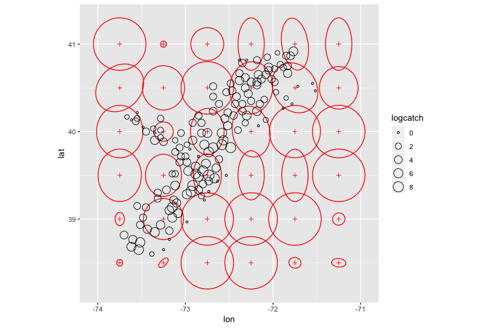
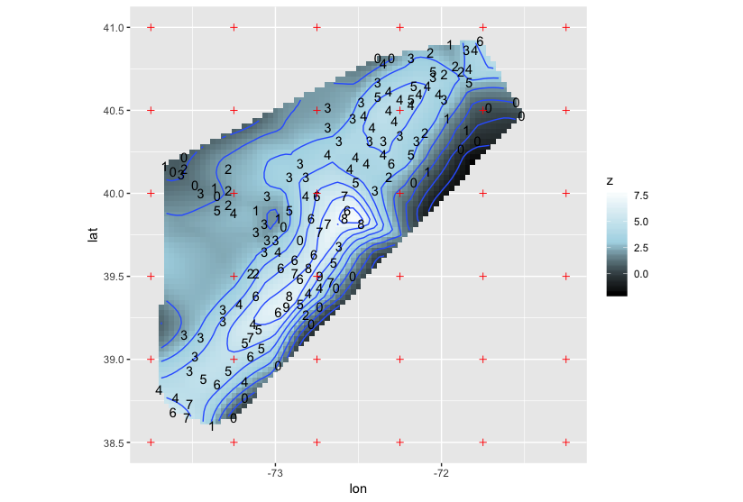

# Description

Scallops is an R package for geostatistical modeling. 
It is inspired by the paper Lemos and Sanso' (2012).

## Installation

You can install the github development version via

```R
devtools::install_github('rtlemos/Scallops')
```

## Example

Let us load the famous "scallop" data and plot the georeferenced log-catches, 
along with a grid that we will use to interpolate those values.

```R
library(SemiPar)
library(ggmap)
data(scallop)
scallop$logcatch = log(scallop$tot.catch + 1)
dpc_grid = get_grid(c(-73.75, -71.25), c(38.5, 41), 0.5)

map.ny = get_map(location = c(-72.5, 39.75), zoom = 8)
ggmap(map.ny) + 
  geom_point(data = scallop, aes(x = longitude, y = latitude, size = logcatch), shape = 1) +
  geom_point(data = dpc_grid$coord, aes(x = lon, y = lat), shape = 3, color = 'red')
```

We will be placing one Gaussian variable over each gridpoint. 
To have an idea of its influence on the interpolation, let us pick one in the
middle of the plot, (39.5N, -73E), and depict how its weight changes across space.

```R
get_influence_plot(dpc_grid, lat = 39.5, lon = -72.75)
```



The plot above is for an "isotropic" kernel (actually, the kernel is not exactly isotropic,
because we are using a latitude-longitude coordinate system). 
By default, the kernel's range corresponds to twice the grid spacing.

Let us now fit the model and depict the spatial variation of the 
posterior weight for the same Gaussian variable.

```R
fit = get_mcmc(s = data.frame(lon = scallop$longitude, lat = scallop$latitude), 
               dpc_grid = dpc_grid, y = scallop$log10catch)
plot_influence(get_gridpoint_influence(dpc_grid, lat = 39.5, lon = -73, fit = fit))
```



We can also look at the shape of the kernels at all gridpoints.

```R
get_ellipses_plot(dpc_grid, fit)
```


And finally, let us look at the interpolation.

```R
get_interpolation_plot(obs_coord = scallop, dpc_grid = dpc_grid, fit = fit, contour_binwidth = 1,
                       obs_as_labels = TRUE)
```



